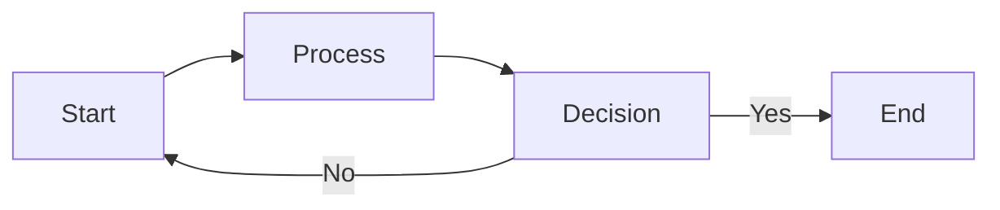
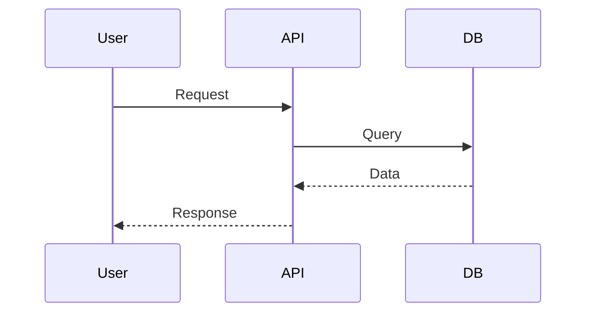
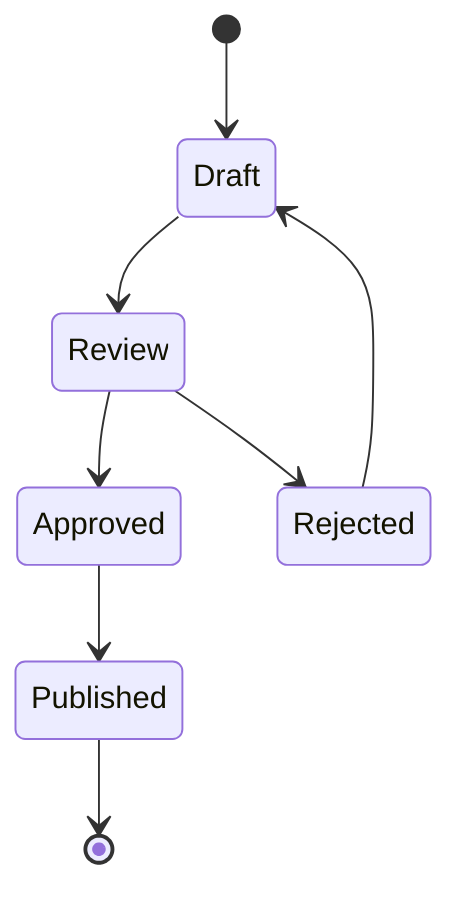
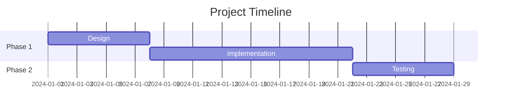
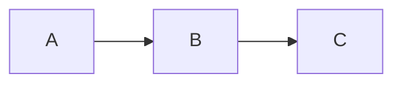

# Linear CLI Content Formatting Guide

This guide documents supported markdown features, cross-referencing syntax, and content limits for the Linear CLI, specifically for AI agents and automation.

## Table of Contents

- [Markdown Support](#markdown-support)
- [Cross-Referencing](#cross-referencing)
- [Content Length Limits](#content-length-limits)
- [Best Practices](#best-practices)

## Markdown Support

Linear supports full GitHub-Flavored Markdown (GFM) in issue descriptions, project descriptions, and document content.

### Tested and Working Features

#### Basic Formatting

```markdown
**Bold text** and _italic text_ and `inline code`

> Blockquotes work Across multiple lines

---

Horizontal rules for visual separation
```

#### Lists

```markdown
- Bullet points
  - Nested bullets
  - Work perfectly

1. Numbered lists
2. Also supported
3. With proper ordering
```

#### Tables

```markdown
| Feature | Status      | Priority |
| ------- | ----------- | -------- |
| Auth    | Done        | High     |
| API     | In Progress | Medium   |
| UI      | Not Started | Low      |
```

**Result**: Tables render with proper alignment and formatting in Linear's UI.

#### Code Blocks

````markdown
```typescript
function example(): string {
  return "Code blocks work with syntax highlighting"
}
```
````

**Supported Languages**: TypeScript, JavaScript, Python, Go, Rust, Java, and many more.

#### Checklists

```markdown
- [ ] Unchecked task
- [x] Completed task
- [ ] Another pending task
```

**Result**: Linear converts these to interactive checkboxes in the UI.

#### Mermaid Diagrams

Linear has **full support** for Mermaid diagrams:

##### Flow Charts

````markdown

````

##### Sequence Diagrams

````markdown

````

##### State Diagrams

````markdown

````

##### Gantt Charts

````markdown

````

**Result**: All Mermaid diagram types render interactively in Linear's UI.

## Cross-Referencing

Linear supports automatic linking to issues, users, and other resources using special syntax.

### Issue References

Reference issues by their identifier (team key + number):

```markdown
This relates to DIV-123

See also: DIV-456, DIV-789

Blocking: DIV-100
```

**Result**: Linear automatically converts these to clickable links to the referenced issues.

### User Mentions

Mention users using the `@` symbol:

```markdown
@username please review

CC: @display-name for visibility
```

**Supported Formats**:

- `@username` (Linear username)
- `@display-name` (User's display name)

**Result**: Mentioned users receive notifications and the references become clickable.

### Project References

Reference projects by name:

```markdown
Part of project: Mobile App Redesign
```

**Note**: Linear doesn't have special syntax for project linking, but text mentions provide context.

### URL References

Paste full Linear URLs for explicit linking:

```markdown
[Related Issue](https://linear.app/workspace/issue/DIV-123/title) [Design Doc](https://linear.app/workspace/document/doc-slug-id)
```

**Result**: Standard markdown links work as expected.

### Cross-Reference Example

```markdown
## Issue Summary

**Assignee**: @jfbg84

**Related Issues**:

- Blocks DIV-100
- Related to DIV-101, DIV-102

**Documentation**: https://linear.app/workspace/document/technical-spec

CC: @john @jane for review
```

## Content Length Limits

Based on testing with the Linear GraphQL API:

### Issue Descriptions

- **Tested and Working**: Up to 200,000 characters (200KB)
- **Recommended Maximum**: 100,000 characters for optimal performance
- **Practical Limit**: ~50,000 characters for readability

#### Test Results

| Size  | Status     | Notes            |
| ----- | ---------- | ---------------- |
| 10KB  | ✅ Success | Optimal size     |
| 50KB  | ✅ Success | Still manageable |
| 100KB | ✅ Success | Large but works  |
| 200KB | ✅ Success | Maximum tested   |

### Document Content

- **Maximum Limit**: Between 200KB and 500KB
- **Tested and Working**: Up to 200,000 characters
- **Failed**: 500,000 characters (API validation error)
- **Recommended Maximum**: 150,000 characters

#### Test Results

| Size  | Status     | Notes                  |
| ----- | ---------- | ---------------------- |
| 10KB  | ✅ Success | Optimal size           |
| 50KB  | ✅ Success | Good for most docs     |
| 100KB | ✅ Success | Large document         |
| 200KB | ✅ Success | Maximum tested working |
| 500KB | ❌ Failed  | Exceeds API limits     |

### Project Descriptions

- **Same as Issue Descriptions**: Up to 200KB tested and working

### Practical Recommendations

For AI agents creating content:

1. **Issues**: Keep descriptions under 10KB for best UX
2. **Documents**: Can go larger (50-100KB) for comprehensive specs
3. **Split Large Content**: If you need more than 100KB, consider:
   - Creating multiple linked documents
   - Using external documentation with links
   - Splitting into parent/child issues

## Best Practices

### For AI Agents

1. **Always Use Markdown**: Rich formatting improves readability
   ```bash
   linear issue create --title "Feature" --description "$(cat spec.md)"
   ```

2. **Use Mermaid for Architecture**: Diagrams are worth 1000 words
   ````markdown
   ## Architecture

   ```mermaid
   graph TB
       Client --> API
       API --> DB
   ```
   ````

3. **Cross-Reference Liberally**: Link related issues and docs
   ```markdown
   Implements DIV-100 See design in DIV-101
   ```

4. **Use Tables for Structure**: Better than plain text lists
   ```markdown
   | Endpoint   | Status |
   | ---------- | ------ |
   | /api/users | Ready  |
   ```

5. **Add Checklists for Tasks**: Interactive and trackable
   ```markdown
   - [ ] Implement feature
   - [ ] Write tests
   - [ ] Update docs
   ```

### Content Organization

#### Issue Descriptions

````markdown
## Summary

Brief overview in 1-2 sentences

## Details

More comprehensive information

## Technical Approach


````

## Tasks

- [ ] Task 1
- [ ] Task 2

## Related

- Depends on: DIV-100
- Blocked by: DIV-101

````
#### Document Structure

```markdown
# Title

## Overview
What this document covers

## Architecture
```mermaid
graph TB
    Component1 --> Component2
````

## Implementation Details

### Module A

Details...

### Module B

Details...

## API Reference

| Endpoint | Method | Description |
| -------- | ------ | ----------- |
| /api/foo | GET    | ...         |

## Next Steps

- [ ] Checklist of todos

````
### Performance Tips

1. **Limit Mermaid Complexity**: Keep diagrams under 50 nodes
2. **Use Tables Sparingly**: More than 20 rows? Consider a document
3. **Cache Lookups**: CLI caches users, workflows, and statuses for 24h
4. **Batch Operations**: Use JSON output for programmatic workflows

## CLI Examples

### Create Issue with Rich Content

```bash
cat > issue.md << 'EOF'
## Overview
Feature description here

## Architecture
```mermaid
graph LR
    UI --> API
    API --> DB
````

## Tasks

- [ ] Design UI
- [ ] Implement API EOF

linear issue create\
--team ENG\
--title "Rich Feature"\
--description "$(cat issue.md)"

````
### Create Document with Mermaid

```bash
linear document create \
  --project "API Redesign" \
  --title "Technical Spec" \
  --content "$(cat technical-spec.md)"
````

### Cross-Reference Pattern

```bash
# Get current issue from branch
CURRENT=$(linear issue view  | jq -r '.issue.identifier')

# Create related issue
linear issue create \
  --title "Follow-up Task" \
  --description "Related to ${CURRENT}"
```

## Testing Your Content

Before using in production, test content formatting:

```bash
# Test length
wc -c < content.md

# Preview locally
cat content.md | markdown-viewer

# Test with CLI
linear issue create \
  --team TEST \
  --title "Format Test" \
  --description "$(cat content.md)"
```

## Known Limitations

1. **No HTML**: HTML tags are stripped or escaped
2. **No Embeds**: YouTube, etc. not supported (use links)
3. **Image Limits**: Inline images limited by platform
4. **Math Equations**: LaTeX/MathJax not supported in Mermaid

## Changelog

- **2025-10-29**: Initial documentation based on comprehensive testing
  - Confirmed Mermaid diagram support
  - Documented content length limits
  - Added cross-referencing syntax
  - Provided AI agent best practices
